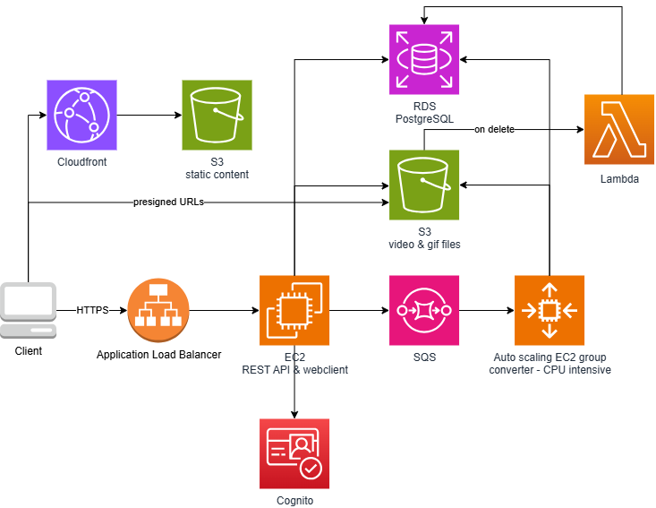
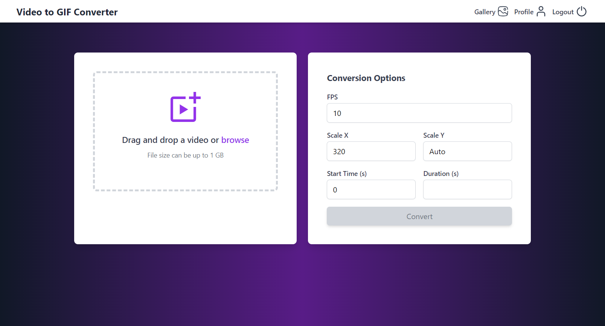
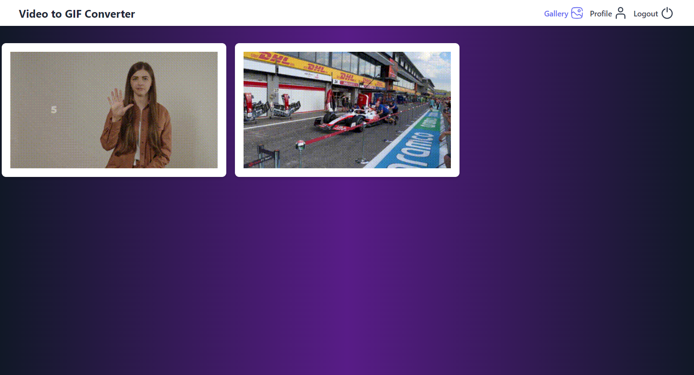
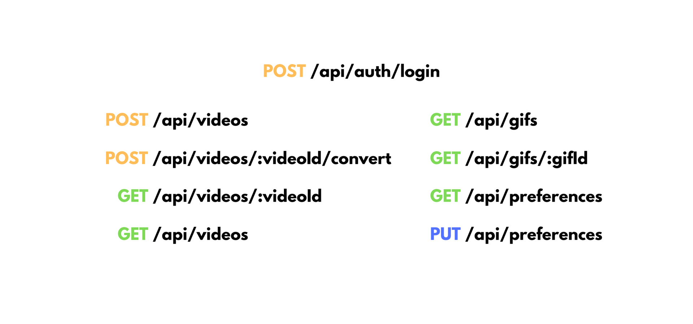

# video2gif 🎥➡️🎞️

**video2gif** is a Node.js and Express application that converts videos to GIFs using the `ffmpeg` library. The primary interface is a REST API, but it also includes a web client with a simple, modern design built using Express, EJS, and Tailwind CSS. Application is deployed on **AWS**.

## Features

The **video2gif** application allows users to upload their videos and create GIFs from them.
The conversion from video to GIF is highly customizable with attributes like FPS, the scale of the resulting GIF, or the time range of the video from which the GIF is to be created.

Each user has their own account in the app, enabling them to view all their created GIFs in a gallery.
Additionally, they can set default settings for the video-to-GIF conversion.

## Architecture

- **Application Load Balancer**: Used for integration with HTTPS certificate. It is also prepared for future scaling of the REST API and web client, if needed.
- **EC2**: Public facing API server and web client.
- **Cognito**: Used for customer identity and access management.
- **SQS**: A queue where the API server sends requests for video-to-GIF conversion. Converters retrieve from the queue and process the requests.
- **Auto scaling EC2 group**: Each EC2 instance runs a service responsible for converting videos to GIFs. The Auto Scaling group automatically scales this group of EC2 instances based on CPU load.
- **S3 video & gif files**: S3 bucket used to store uploaded video files and converted GIF files.
- **RDS**: PostgreSQL database storing files metadata files ownership data and users' default settings.
- **Lambda**: Serverless function triggered on file deletion from S3 bucket. Updates the `fileInS3` flag in database.
- **S3 static content**: S3 bucket used to store web client static content such as CSS and JS files.
- **Cloudfront**: CDN that helps with distributing the static content.

## Preview

### Conversion Page

### Gallery Page

### Login Page

### REST API

## Technologies used
- **Backend:** Typsecript, Node.js, Express
- **Frontend:** Express, EJS, Tailwind CSS
- **Video Processing:** ffmpeg
- **Cloud Infrastructure:** AWS
