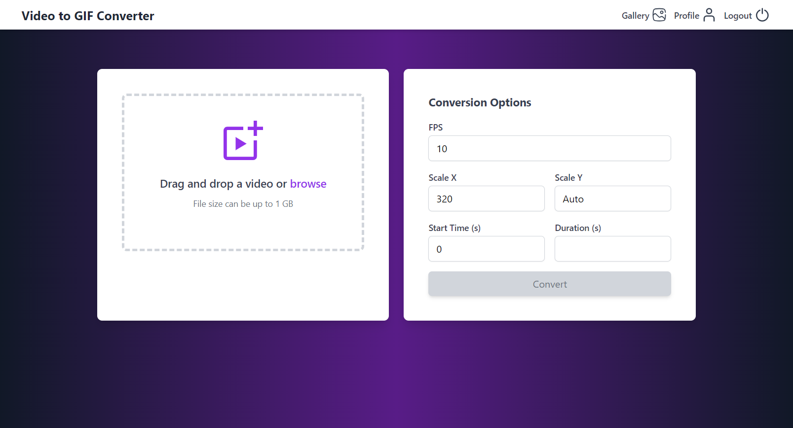
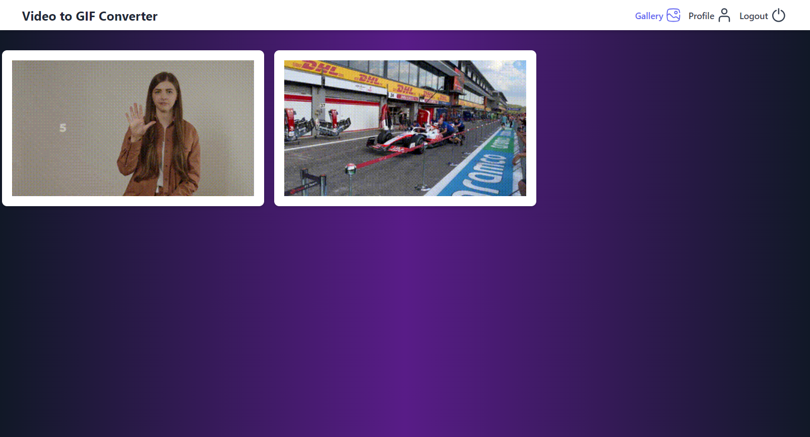
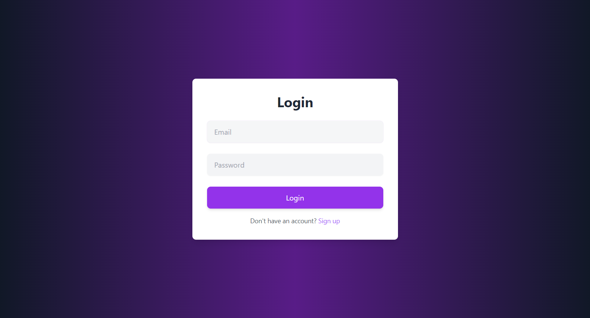

# video2gif

**video2gif** is a Node.js and Express application that converts videos to GIFs using the `ffmpeg` library. The primary interface is a REST API, but it also includes a web client with a simple, modern design built using Express, EJS, and Tailwind CSS.

## Preview

### Conversion Page


### Gallery Page


### Login Page


## Features

- **Video to GIF Conversion:** Convert uploaded videos into GIFs with customizable settings using the `ffmpeg` library.
- **REST API:** A robust API allowing users to upload videos and manage their conversion preferences.
- **User Preferences:** Each user can save custom conversion preferences, such as frame rate (FPS) and scaling options.
- **Web Client:** A sleek, responsive web interface that allows users to upload videos, adjust conversion settings, and preview/download converted GIFs.
- **Gallery:** View previously converted GIFs in a user-specific gallery.

## Technologies Used

- **Backend:** Node.js, Express
- **Frontend:** Express, EJS, Tailwind CSS
- **Video Processing:** ffmpeg
- **Authentication:** JSON Web Token (JWT)

## Installation

1. Clone the repository:
```bash
git clone https://github.com/yourusername/video2gif.git
```

2. Navigate to the project directory
```bash
cd video2gif
```

3. Install dependencies
```bash
npm install
```

4. Create `.env` file based on the `.env.example` file, and configure your environment variables.

5. Build the application
```bash
npm run build
```

6. Run the application
```bash
npm run start
```

Also make sure you have PostgreSQL database set up and running!

Alternatively from point 2 you can just run
```bash
docker compose up
```
to start application in docker container!
